[](#)

# Kashier-iOS-SDK
Create seamless checkout experience for your customers !


[Kashier](https://kashier.io/) is a payments platform built to empower 
and simplify your business by providing you with 
simple and efficient tools to make it easier to 
run your business.

> Please check [CHANGELOG.md](/CHANGELOG.md) for changes, in case you're upgrading your existing installation of the SDK.

- [Features](#Features)
- [Prerequisites](#Prerequisites)
- [API Documentation](https://test-api.kashier.io/api-docs/#/)
- [SDK Installation](#SDK-Installation)
- [Getting Started](#Getting-Started)
- [Save Shopper Card](#Save-Shopper-Card)
- [List Shopper Card](#List-Shopper-Card)
- [Pay With Token](#Pay-With-Token)
    - [Pay with Temp Token](#Pay-With-Temp-Token)
    - [Pay with Perm Token](#Pay-With-Perm-Token)
- [Payment with Card](#Payment-with-Card)
- [Payment with Form](#Payment-with-Form)
- [Payment with Custom Form](#Payment-with-Custom-Form)
- [Testing Data](#Testing-Data)
    - [Card Holder Name](#Card-Holder-Name)
    - [Test Cards](#Test-Cards)
        - [Card Numbers](#Card-Numbers)
        - [CVV](#CVV)
        - [Expiry Date](#Expiry-Date)
- [Data Models](#Data-Models)
- [Example App](#example-app)


## Features
- Pay via kashier Payment API
- Save user Card as Token (Perm/Temp)
- List user Cards
- Pay & Save Card via kashier API (One Action)
- Pay With Token via API (Perm/Temp)
<!-- - Pay via Kashier Form. (Coming Soon) -->

# Getting Started
## Prerequisites
You’ll need an **API Key**, and a **Merchant ID**.

To geth both
To get those 2 items:
- Login to your [dashboard](https://merchant.kashier.io/en/login)
- Go to **Integrate Now** -> **Customizable Forms** -> **Get the API key**. 
  - (Please make sure that you are using the right mode(Live/Test) before copying the API Key).
  - On the top-right corner of the dashboard, you will find your **MID**. 


### Verify Transaction Status
 - use the [**Authentication endpoint**](https://test-api.kashier.io/api-docs/#/Authenticate)
 -  Then, use [**Transactions endpoint**](https://test-api.kashier.io/api-docs/#/transactions) to get the transaction.
    - You will need your sent order id and the second parameter is the transaction id


## SDK Installation
Please note that all the methods are of type 'Void'

- Get our latest framework (xcframework) version from [Releases](https://github.com/Kashier-payments/Kashier-IOS-SDK/releases)
- Extract the .zip file to get the **.xcframework**
- Drag the .xcframework to your project 


- Choose Copy Items


- From the left side, make sure your project is selected, 
    - Select your **Target**
    - Under **Frameworks, Libraries, and Embedded Content**, find **KashierPaymentSdk.framework**
    - choose (Embed Without Signing, or Embed & Sign)
    
    

- Import the SDK to your code
```swift
import  KashierPaymentSDK
```
- [Initialize](#Initialization) the SDK


## Initialization
You'll need to initialize the SDK once before using any of the APIs


```swift
Kashier.initialize(
    merchantId: String,
    apiKey: String,
    sdkMode: KASHIER_SDK_MODE,
    currency: String? = "EGP",
    displayLang: KASHIER_DISPLAY_LANG? = KASHIER_DISPLAY_LANG.EN)
```

```swift
let merchantId : String = "MID-XXXX-XXXX"
let apiKey : String = "XXXXXXXX-XXXX-XXX-XXXXX-XXXXXXXXXXXX"
var shopperReference :String = "XXXXXXXXXXXX"

let sdkMode : KASHIER_SDK_MODE = .DEVELOPMENT

Kashier.initialize(merchantId: merchantId, apiKey:apiKey, sdkMode: sdkMode)
```

| Parameters | Type | Description|
| ------ | ------ | ------ |
| merchantId | String | [Merchant ID](#Prerequisites) |
| apiKey | String | [API Key](#Prerequisites) |
| sdkMode | [KASHIER_SDK_MODE](#KASHIER_SDK_MODE) | To switch between testing and live modes |
| currency | String  | Defaults to EGP, We Support ISO currencies(EGP, USD, GBP, EUR)|
| displayLang | [KASHIER_DISPLAY_LANG?](#KASHIER_DISPLAY_LANG) | To get the translated message from response|


# Save Shopper Card
Use this API to save a user card (Create a token), for later usage as [Pay With Token](#Pay-With-Token)
****
There are 2 Types of [tokens](#KASHIER_TOKEN_VALIDITY)
- **Temporary**: Used for Multiple page checkout, expires within a limited time
- **Permanent**: Card data is Saved at Kashier, can be used for any future transactions


```swift
Kashier.saveShopperCard(
		cardData : Card,
		shopperReference: String,
		tokenValidity : KASHIER_TOKEN_VALIDITY,
		tokenizationCallback : TokenizationCallback) 
```

**Example**
```swift
var cardData : Card = Card(cardHolderName: name, cardNumber: numCard, cardCcv: cvv, cardExpiryMonth: month , cardExpiryYear: year)
var shopperReference :String = "XXXXXX"
var tokenType : KASHIER_TOKEN_VALIDITY = .PERMANENT

Kashier.saveShopperCard(cardData: cardData,
                    shopperReference: shopperReference,
                    tokenValidity: tokenType,
                    tokenizationCallback: TokenizationCallback(
                        onResponse:{
                            (TokenizationResponse) -> (Void) in
                            debugPrint("Save Shopper Card Success")
                            debugPrint("Card Token: \(TokenizationResponse.cardData?.cardToken ?? "")")
                            debugPrint("CVV Token: \(TokenizationResponse.cardData?.ccvToken ?? "NO CCV TOKEN FOR PERM TOKENS")")
                            cardToken = TokenizationResponse.cardData?.cardToken ?? ""
                            ccvToken = TokenizationResponse.cardData?.ccvToken ?? ""
                    },
                        onFailure: {
                            (tokenizationError :ErrorData) -> (Void) in
                            debugPrint("Tokenization failed \(tokenizationError.getErrorMessage())")
                    }
))
```

| Parameters | Type | Description|
| ------ | ------ | ------ |
| cardData | [Card](#Card) | Card Details |
| shopperReference | String | User Unique ID in your system |
| tokenValidity | [KASHIER_TOKEN_VALIDITY](#KASHIER_TOKEN_VALIDITY) | Wheter to use a temp or perm token |
| tokenizationCallback | [TokenizationCallback?](#TokenizationCallback) | Callback that returns success or failure for Saving the card |


# List Shopper Card
Used to get a list of previously saved cards
Tokens are saved with one of the following conditions should be available in this api
- Tokens saved with [Save Shopper Card](#Save-Shopper-Card), with [**tokenValidity**](#KASHIER_TOKEN_VALIDITY) set to **PERMANENT**
- Tokens saved with [Payment with Card](#Payment-with-Card), with **shouldSaveCard** set to **true**


NOTE: Temp tokens are not saved, so they are not listed in this API

```swift
Kashier.listShopperCards(shopperReference: String, userCallBack : TokensListCallback)
```
**Example**
```swift
Kashier.listShopperCards(
    shopperReference:shopperReference,
    userCallBack: TokensListCallback(
        onResponse: { (tokensResponse ) -> (Void) in
            debugPrint("Login Tokens List Resposne succ")
            if let _tokens = tokensResponse.response?.tokens {
                for token in _tokens {
                    print("Card: \(token.cardNumber ?? "") \( token.cardExpiryMonth ?? "" )/\(token.cardExpiryYear ?? "") \(token.token ?? "")")
                }
            }
    }, onFailure: { (tokensListError) -> (Void) in
        debugPrint("Error in tokens list response:  \(tokensListError.getErrorMessage())")
    }))
```
| Parameters | Type | Description|
| ------ | ------ | ------ |
| shopperReference | String | User Unique ID in your system |
| tokenValidity | [KASHIER_TOKEN_VALIDITY](#KASHIER_TOKEN_VALIDITY) | Wheter to use a temp or perm token |
| TokensListCallback | [TokensListCallback?](#TokensListCallback) | Callback that returns success with list of cards, or failure |

# Pay With Token
## Pay with Temp Token
Used to pay using a card token created using [Save Shopper Card](#Save-Shopper-Card) with [tokenValidity](#KASHIER_TOKEN_VALIDITY) set to **TEMPORARY** 
```swift
Kashier.payWithTempToken(
    shopperReference : String,
    orderId: String,
    amount : String,
    cardToken: String,
    cvvToken : String,
    paymentCallback : PaymentCallback)
```

**Example**
```swift
Kashier.payWithTempToken(
    shopperReference: shopperReference,
    orderId: orderId,
    amount: Amount,
    cardToken: cardToken,
    cvvToken: ccvToken,
    paymentCallback: PaymentCallback(onResponse: { (succ) -> (Void) in
            print("Payment with Token Success: \(succ.getResponseMessageTranslated())")
        }) { (error) -> (Void) in
            print("Payment with Token Error: \(error.getErrorMessage())")
			})
```
| Parameters | Type | Description|
| ------ | ------ | ------ |
| shopperReference | String | User Unique ID in your system |
| orderId | String | User Order ID in your system |
| amount | String | Amount as a string, with max 2 Decimal digits |
| cardToken | String | cardToken from [Save Shopper Card](#Save-Shopper-Card) |
| cvvToken | String | cvvToken from [Save Shopper Card](#Save-Shopper-Card) |
| paymentCallback | [PaymentCallback?](#PaymentCallback) | Callback that returns success or failure for the payment |


## Pay with Perm Token
Used to pay using a card token created using [Save Shopper Card](#Save-Shopper-Card) with [tokenValidity](#KASHIER_TOKEN_VALIDITY) set to **PERMANENT** 


```swift
Kashier.payWithPermToken(
    shopperReference : String,
    orderId: String,
    amount : String,
    cardToken: String,
    paymentCallback : PaymentCallback)

```

```swift
Kashier.payWithPermToken(
    shopperReference: shopperReference,
    orderId: orderId,
    amount: Amount,
    cardToken: cardToken,
    paymentCallback: PaymentCallback(onResponse: { 
        (succ) -> (Void) in
                print("Payment with Token Success: \(succ.getResponseMessageTranslated())")
            }) { (error) -> (Void) in
                print("Payment with Token Error: \(error.getErrorMessage())")
        })

```

| Parameters | Type | Description|
| ------ | ------ | ------ |
| shopperReference | String | User Unique ID in your system |
| orderId | String | User Order ID in your system |
| amount | String | Amount as a string, with max 2 Decimal digits |
| cardToken | String | cardToken from [Save Shopper Card](#Save-Shopper-Card) or  [List Shopper Card](#List-Shopper-Card)|
| paymentCallback | [PaymentCallback?](#PaymentCallback) | Callback that returns success or failure for the payment |


# Payment with Card
Used to pay using card data directly, can be customized with your Payment Form

```swift
 Kashier.payWithCard(
		cardData : Card,
		orderId : String,
		amount : String,
		shopperReference : String,
		shouldSaveCard : Bool,
		paymentCallback : PaymentCallback)
```
**Example**
```swift
Kashier.payWithCard(cardData: cardData,
                    orderId: orderId,
                    amount: Amount,
                    shopperReference: shopperReference,
                    shouldSaveCard: true,
                    paymentCallback: PaymentCallback(onResponse: { (succ) -> (Void) in
                        print("Payment with card Success: \(succ.getResponseMessageTranslated())")
                    }) { (error) -> (Void) in
                        print("Payment with card Error: \(error.getErrorMessage())")
})
```

| Parameters | Type | Description|
| ------ | ------ | ------ |
| cardData | [Card](#Card) | Card Details |
| orderId | String | User Order ID in your system |
| amount | String | Amount as a string, with max 2 Decimal digits |
| shopperReference | String | User Unique ID in your system |
| shouldSaveCard | Bool | Wheter to save the card after the transaction or not |
| paymentCallback | [PaymentCallback?](#PaymentCallback) | Callback that returns success or failure for the payment |

# Payment with Form
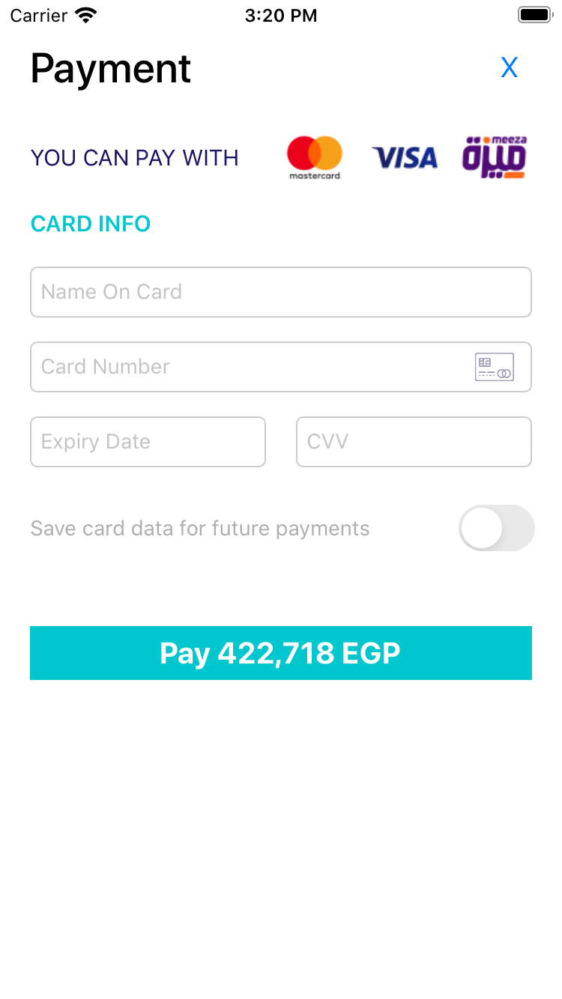
Used to pay using our Payment Form template as in the above screenshot, with option to allow saving the card for future payments, Internally uses [Payment with Card](#Payment-with-Card) API

```swift
Kashier.payUsingPaymentForm(
		orderId: String,
		amount: String,
		shopperReference: String,
		paymentCallback: PaymentCallback,
		customXibFile: String? = nil)
```
**Example**
```swift
Kashier.payUsingPaymentForm(
    orderId: orderId,
    amount: Amount,
    shopperReference: shopperReference,
    paymentCallback: PaymentCallback(
        onResponse: {
            (succ) -> (Void) in
            print("Payment with Form Success: \(succ.getResponseMessageTranslated())")
        }) {
            (error) -> (Void) in
        print("Payment with Form Error: \(error.getErrorMessage())")
    })
```

| Parameters | Type | Description|
| ------ | ------ | ------ |
| orderId | String | User Order ID in your system |
| amount | String | Amount as a string, with max 2 Decimal digits |
| shopperReference | String | User Unique ID in your system |
| paymentCallback | [PaymentCallback?](#PaymentCallback) | Callback that returns success or failure for the payment |
| customXibFile | [customXibFile?](#customXibFile) | Custom .xib file path for the custom form |

# Payment with Custom Form

## How to use a custom Payment Form?


1 - Create a new file

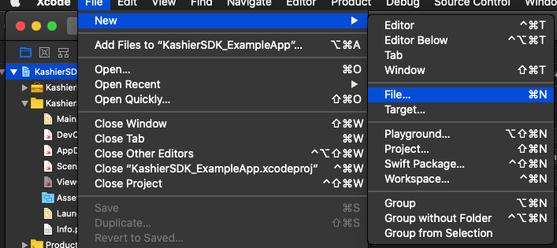

2 - User Interface -> View 

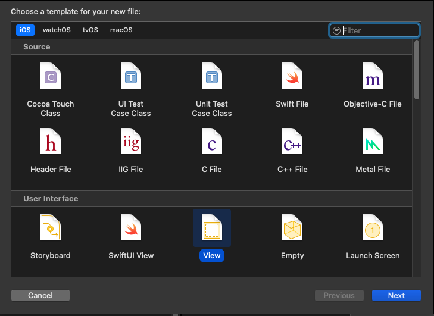

3 - Choose a name for your xib file (will be used in below code example)

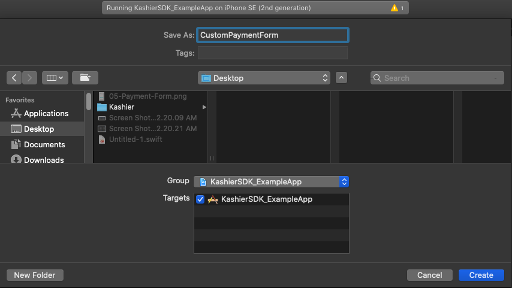

4 - On the left side, make sure you selected "Placeholders/File's Owner". On the right side, make sure you choose the 4th tab (IDentity inspector).
Update the custom class "Class" attribute to **PaymentFormViewController**

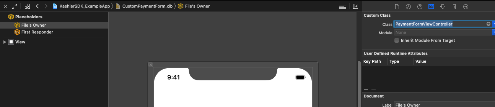

5 - Create your design as in the screenshot below,
* 4 UITextField, and 4 Labels for their error messege 
    * Card Holder Name
    * Card Number
    * Card Expiry Date
    * Card CVV
* 1 UISwitch (for saving card for future transactions check)
* 1 UIButton (For payment)
* 1 Cancel button *[Optional]* (to close the view)

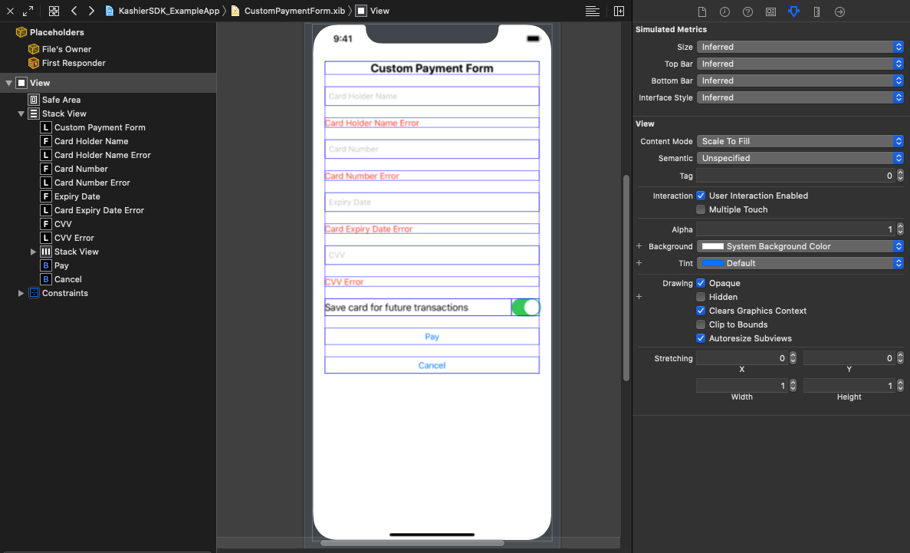

6 - Select all 4 UITextInputs created, on the right side, make sure you're selecting "Identity Inspector" in xcode, and update the custom class
* Class: **CustomUITextField**
* Module: **KashierPaymentSDK**

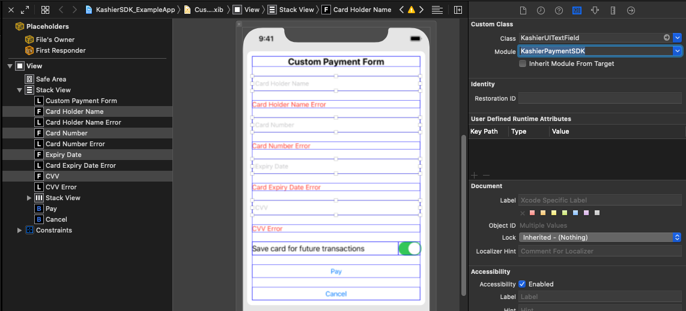

7 - Make sure you're on ***Placeholders -> File's Owner*** on the left side, and ***Connection Inspector*** tab on the right side
(Optional) Connection action outlet for cancel button

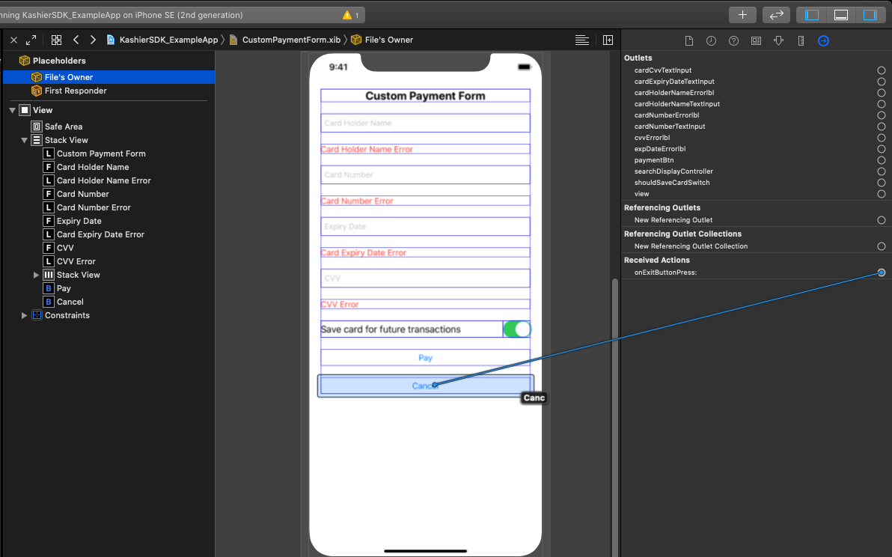

8 - Choose Touch Up Inside

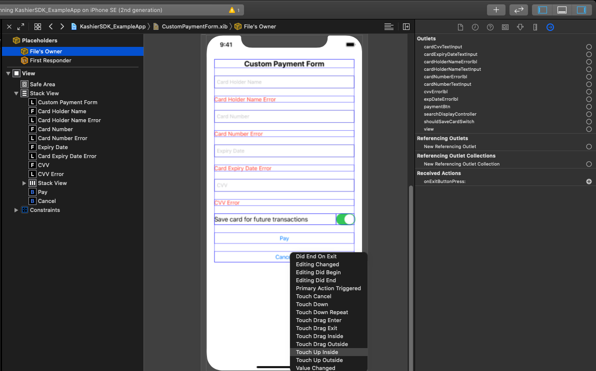

9 - Connect View outlet

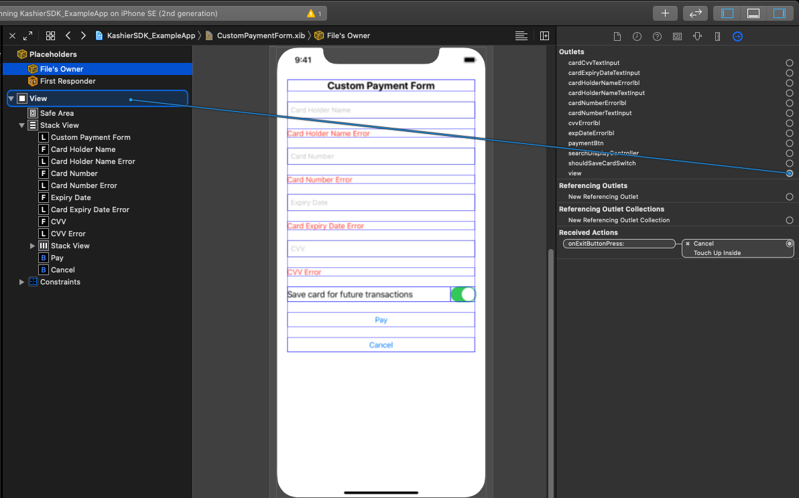
10 - Connect the rest of the outlets

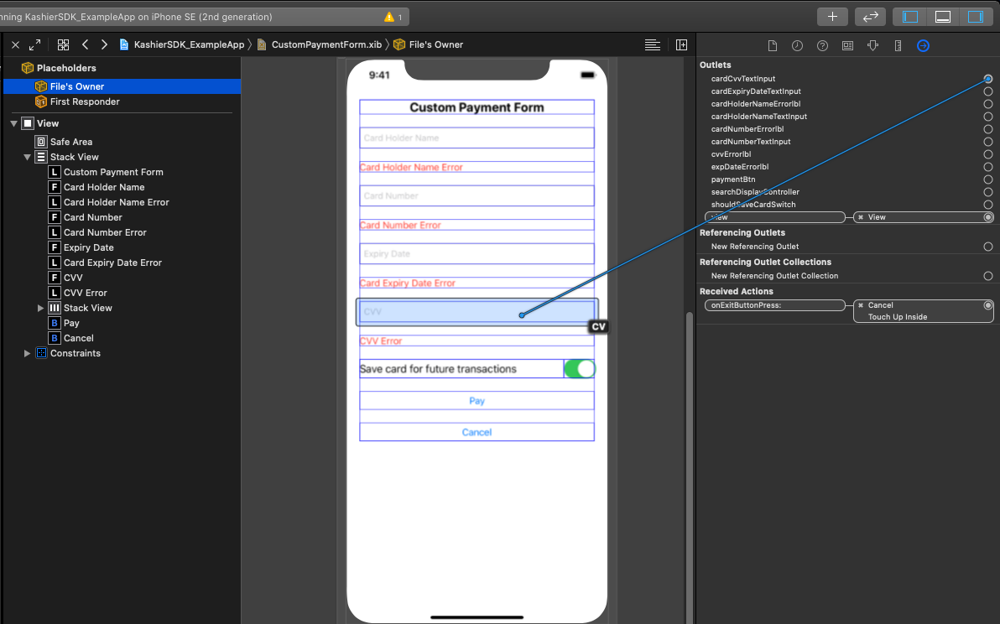

11 - The added components should appear like that on the Connections Inspector

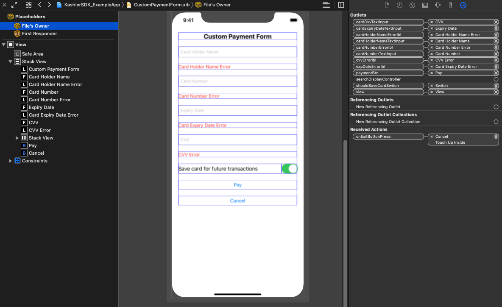

12 - Call the payUsingPaymentForm with **customXibFile** as the file name

### Code
```swift
Kashier.payUsingPaymentForm(
		orderId: String,
		amount: String,
		shopperReference: String,
		paymentCallback: PaymentCallback,
		customXibFile: String? = nil)
```
**Example**
```swift
Kashier.payUsingPaymentForm(
    orderId: orderId,
    amount: Amount,
    shopperReference: shopperReference,
    paymentCallback: PaymentCallback(
        onResponse: {
            (succ) -> (Void) in
            print("Payment with Form Success: \(succ.getResponseMessageTranslated())")
        }) {
            (error) -> (Void) in
        print("Payment with Form Error: \(error.getErrorMessage())")
    },
    customXibFile: "CustomPaymentForm")
```

| Parameters | Type | Description|
| ------ | ------ | ------ |
| orderId | String | User Order ID in your system |
| amount | String | Amount as a string, with max 2 Decimal digits |
| shopperReference | String | User Unique ID in your system |
| paymentCallback | [PaymentCallback?](#PaymentCallback) | Callback that returns success or failure for the payment |
| customXibFile | [customXibFile?](#customXibFile) | Custom .xib file path for the custom form |

The form should look like the below screenshots

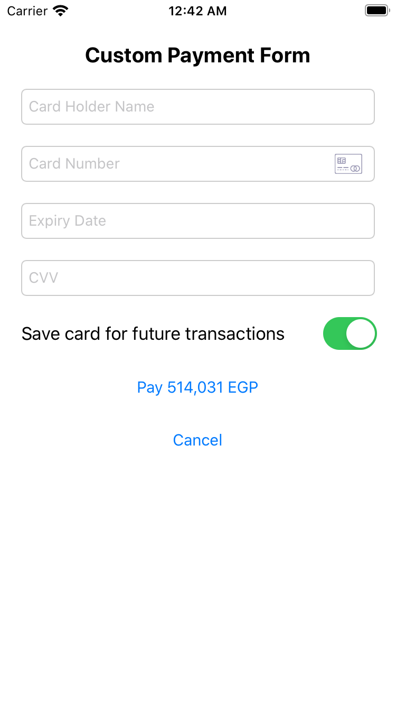

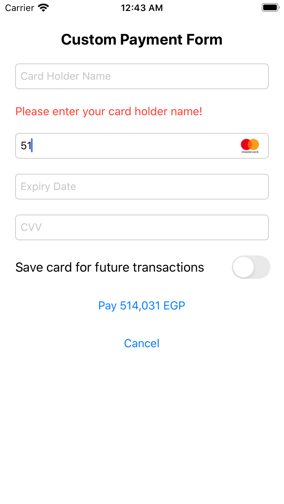

# Testing Data
You can use the following testing data
## Card Holder Name
John Doe
## Test Cards
### Card Numbers
| Test Cards | Card Number | 3-D Secure Enabled|
| ------ | ------ | ------ |
| MasterCard | 5123450000000008 | Yes |
|  | 2223000000000007 | Yes |
|  | 5111111111111118 | No |
| Visa | 4508750015741019 | Yes |
|  | 4012000033330026 | No |
### CVV
| CSC/CVV |  CSC/CVV Response GW Code |
| ------ | ------ |
| 100 |  Match |
| 101 |  NOT_PROCESSED |
| 100 |  NO_MATCH |

### Expiry Date
| Expiry Date |  Transaction Response GW Code |
| ------ | ------ |
| 05/21 |  APPROVED |
| 02/22 |  DECLINED |
| 04/27 |  EXPIRED_CARD |
| 08/28 |  TIMED_OUT |
| 01/37 |  ACQUIRER_SYSTEM_ERROR |
| 02/37 |  UNSPECIFIED_FAILURE |
| 05/37 |  UNKNOWN |


# Data Models
## Enums
### KASHIER_SDK_MODE
```swift
	public enum KASHIER_SDK_MODE {
		case DEVELOPMENT
		case PRODUCTION
	}
```
### KASHIER_DISPLAY_LANG
```swift
	public enum KASHIER_DISPLAY_LANG : String{
		case AR = "ar"
		case EN = "en"
	}
```

### KASHIER_RESPONSE_STATUS
```swift
	public enum KASHIER_RESPONSE_STATUS {
		case
		UNKNOWN,
		SUCCESS,
		FAILURE,
		INVALID_REQUEST,
		PENDING,
		PENDING_ACTION
	}
```
### KASHIER_TOKEN_VALIDITY
```swift
	public enum KASHIER_TOKEN_VALIDITY :String{
		case TEMPORARY = "temp"
		case PERMANENT = "perm"
	}
```


#### ErrorType
```swift
@objc public enum ERROR_TYPE: Int {
	/* The NO_VALUE is to be used only as initial value, since nil can't be used with @objc */
	case NO_VALUE,
		/** In case an API is called without Initializing Kashier */
		INITIALIZATION,
		/** For validation errors on inputs */
		VALIDATION,
		/** For errors from network or Server */
		DATA,
		/** For runtime exceptions */
		EXCEPTION,
		NETWORK_ERROR
}

```

#### KASHIER_RESPONSE_STATUS
```swift
@objc public enum KASHIER_RESPONSE_STATUS :Int {
	/*The NO_VALUE is to be used only as initial value, since nil can't be used with @objc */
	case NO_VALUE,
	UNKNOWN,
	SUCCESS,
	FAILURE,
	INVALID_REQUEST,
	PENDING,
	PENDING_ACTION
}
```


#### VALIDATION_FIELD
Can be helpful in determining the error message for each field, in case of custom payment form
```swift
@objc public enum VALIDATION_FIELD: Int {
	case CARD_HOLDER_NAME,
		CARD_NUMBER,
		CARD_CVV,
		CARD_EXPIRY_DATE,
		SHOPPER_REFERENCE,
		TOKEN_VALIDITY,
		ORDER_ID,
		AMOUNT,
		CARD_TOKEN,
		CVV_TOKEN
}
```

#### VALIDATION_ERROR
```swift
@objc public enum VALIDATION_ERROR: Int {
	case NO_ERROR,
		CARD_HOLDER_NAME_REQUIRED,
		CARD_HOLDER_NAME_INVALID,
		CVV_REQUIRED,
		CVV_INVALID,
		EXPIRY_DATE_REQUIRED,
		EXPIRY_DATE_INVALID,
		CARD_NUMBER_REQUIRED,
		CARD_NUMBER_INVALID,
		CARD_NOT_SUPPORTED,
		SHOPPER_REFERENCE_REQUIRED,
		TOKEN_VALIDITY_REQUIRED,
		ORDER_ID_REQUIRED,
		AMOUNT_REQUIRED,
		AMOUNT_INVALID,
		CARD_TOKEN_REQUIRED,
		CVV_TOKEN_REQUIRED
}
```


## Classes
### Card
```swift
init(cardHolderName: String,
cardNumber: String,
cardCcv: String,
cardExpiryMonth: String,
cardExpiryYear: String)

//OR
init(cardHolderName: String,
cardNumber: String,
cardCcv: String,
cardExpiryDate: String)

//Usage Example

var name : String = "kashier testing user";
var month : String = "09";
var year  : String = "21";
var cvv : String = ""
var numCard : String = ""

var cardData : Card = Card(cardHolderName: name, cardNumber: numCard, cardCcv: cvv, cardExpiryMonth: month , cardExpiryYear: year)
```
### TokenizationCallback
Please refer to example

### TokensListCallback
please refer to example

### PaymentCallback
please refer to example

### customXibFile
xib File path to be used in case it's required to use a custom payment form, please refer to example in [Payment with Custom Form](#Payment-with-Custom-Form)


### ErrorData
```swift
errorType : ErrorType
responseStatus: KASHIER_RESPONSE_STATUS
errorMessage : String //Error message from response, or validation errors for internal validation before API calling (ex: missing parameters, invalid card data, ...)
exceptionErrorMessage: String = "" //in case errorType == ERROR_TYPE.EXCEPTION
networkErrorCode: String = "" // in case  errorType == ERROR_TYPE.NETWORK_ERROR
validationErrors: [ValidationResult] // in case errorType == ERROR_TYPE.VALIDATION
```
### ValidationResult
```swift
validationField: VALIDATION_FIELD
isValid: Bool = false
errorMessage: String
validationErrorCode: VALIDATION_ERROR = VALIDATION_ERROR.NO_ERROR
```


# Example App
This is a quick example app used to provide quick testing for functions provided by our payment SDK


 To use the example app provided in this repo
 ```sh
git clone https://github.com/Kashier-payments/Kashier-IOS-SDK.git
 ```
- Open the project using xCode
- Go to KashierSDK_ExampleApp/DevConfig.swift
- Modify the following parameters and run
- Check [Prerequisites](#Prerequisites) to get **merchantId** and **apiKey**
- **shopperReference** is the user unique ID in your system
```swift
/// Edit these parameters to start using our Example app
let merchantId : String = ""
let apiKey : String = ""
var shopperReference :String = ""
```
- Run the project
### Example App usage
- **Token Type**: Used to toggle between temp/perm tokens
    - Affects the 'Create Token'
- The **Use 3DS**: switch toggles the used card in the the testing, the cards used are from our [Testing Data](#Testing-Data)
- **New Order ID**: Generates a new random order id to be used with transactions
- **New Shopper**: Used to use a new random generated shopper reference to start testing as a different user
- **Create Token**: The token created  is used by the "Pay with token"
- **List Cards**: To get list of saved cards by the "Create Token"(**Perm ONLY**)
- **Pay With Token**: Pay using generated token from **Create Token**
- **Pay With Card**: Pay using Card data directly
    - If TokenType is set to Perm -> Will pay and save the card data, can be found in 'List Cards' after the successful payment
    - If TokenType is set to Temp -> Will pay without saving the card 


- Feel free to put breakpoints in KashierSDK_ExampleApp/ViewController.swift to 
check the behavior of the SDK
